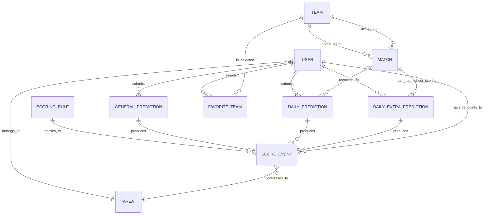

# Modelo Conceptual de Datos

```mermaid
erDiagram
  USER ||--o{ GENERAL_PREDICTION : submits
  USER ||--o{ DAILY_PREDICTION : submits
  USER ||--o{ DAILY_EXTRA_PREDICTION : submits
  USER }o--|| AREA : belongs_to
  USER ||--o{ FAVORITE_TEAM : selects

  TEAM ||--o{ FAVORITE_TEAM : is_selected
  TEAM ||--o{ MATCH : home_team
  TEAM ||--o{ MATCH : away_team

  MATCH ||--o{ DAILY_PREDICTION : receives
  MATCH ||--o{ DAILY_EXTRA_PREDICTION : can_be_highest_scoring

  SCORING_RULE ||--o{ SCORE_EVENT : applies_to
  GENERAL_PREDICTION ||--o{ SCORE_EVENT : produces
  DAILY_PREDICTION ||--o{ SCORE_EVENT : produces
  DAILY_EXTRA_PREDICTION ||--o{ SCORE_EVENT : produces

  SCORE_EVENT }o--|| USER : awards_points_to
  SCORE_EVENT }o--|| AREA : contributes_to
```
