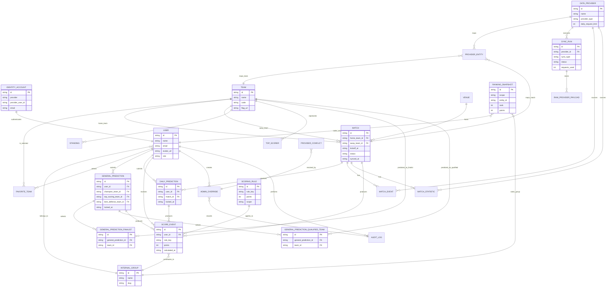

# Modelo Conceptual de Datos

```mermaid
erDiagram
  IDENTITY_ACCOUNT ||--|| USER : authenticates
  USER }o--|| INTERNAL_GROUP : belongs_to
  USER ||--o{ FAVORITE_TEAM : selects
  USER ||--o{ GENERAL_PREDICTION : submits
  USER ||--o{ DAILY_PREDICTION : submits
  USER ||--o{ SCORE_EVENT : receives
  USER ||--o{ ADMIN_OVERRIDE : creates
  USER ||--o{ AUDIT_LOG : performs

  GENERAL_PREDICTION ||--o{ GENERAL_PREDICTION_FINALIST : selects
  GENERAL_PREDICTION ||--o{ GENERAL_PREDICTION_QUALIFIED_TEAM : selects

  TEAM ||--o{ FAVORITE_TEAM : is_selected
  TEAM ||--o{ MATCH : home_team
  TEAM ||--o{ MATCH : away_team
  TEAM ||--o{ STANDING : appears_in
  TEAM ||--o{ TOP_SCORER : represents
  TEAM ||--o{ GENERAL_PREDICTION_FINALIST : predicted_as_finalist
  TEAM ||--o{ GENERAL_PREDICTION_QUALIFIED_TEAM : predicted_as_qualified

  VENUE ||--o{ MATCH : hosts
  MATCH ||--o{ DAILY_PREDICTION : receives
  MATCH ||--o{ MATCH_EVENT : has
  MATCH ||--o{ MATCH_STATISTIC : has
  MATCH ||--o{ SCORE_EVENT : produces

  SCORING_RULE ||--o{ SCORE_EVENT : applies_to
  GENERAL_PREDICTION ||--o{ SCORE_EVENT : produces
  DAILY_PREDICTION ||--o{ SCORE_EVENT : produces

  SCORE_EVENT }o--|| INTERNAL_GROUP : contributes_to
  RANKING_SNAPSHOT }o--|| USER : ranks_user
  RANKING_SNAPSHOT }o--|| INTERNAL_GROUP : ranks_group

  DATA_PROVIDER ||--o{ PROVIDER_ENTITY : maps
  DATA_PROVIDER ||--o{ SYNC_RUN : executes
  SYNC_RUN ||--o{ RAW_PROVIDER_PAYLOAD : stores
  PROVIDER_ENTITY }o--|| TEAM : maps_team
  PROVIDER_ENTITY }o--|| MATCH : maps_match
  DATA_PROVIDER ||--o{ MATCH_EVENT : sources
  DATA_PROVIDER ||--o{ MATCH_STATISTIC : sources
  PROVIDER_CONFLICT }o--|| ADMIN_OVERRIDE : resolved_by
  ADMIN_OVERRIDE }o--|| AUDIT_LOG : records

  IDENTITY_ACCOUNT {
    string id PK
    string provider
    string provider_user_id
    string email
  }

  USER {
    string id PK
    string name
    string email
    string avatar_url
    string role
  }

  INTERNAL_GROUP {
    string id PK
    string name
    string slug
  }

  TEAM {
    string id PK
    string name
    string code
    string flag_url
  }

  MATCH {
    string id PK
    string home_team_id FK
    string away_team_id FK
    string kickoff_at
    string status
    string synced_at
  }

  GENERAL_PREDICTION {
    string id PK
    string user_id FK
    string champion_team_id FK
    string top_scoring_team_id FK
    string best_defense_team_id FK
    string locked_at
  }

  GENERAL_PREDICTION_FINALIST {
    string id PK
    string general_prediction_id FK
    string team_id FK
  }

  GENERAL_PREDICTION_QUALIFIED_TEAM {
    string id PK
    string general_prediction_id FK
    string team_id FK
  }

  DAILY_PREDICTION {
    string id PK
    string user_id FK
    string match_id FK
    string locked_at
  }

  SCORING_RULE {
    string id PK
    string rule_key
    int points
    string scope
  }

  SCORE_EVENT {
    string id PK
    string user_id FK
    string rule_key
    int points
    string calculated_at
  }

  RANKING_SNAPSHOT {
    string id PK
    string scope
    string entity_id
    int rank
    int points
  }

  DATA_PROVIDER {
    string id PK
    string name
    string provider_type
    int daily_request_limit
  }

  SYNC_RUN {
    string id PK
    string provider_id FK
    string sync_type
    string status
    int requests_used
  }
```
