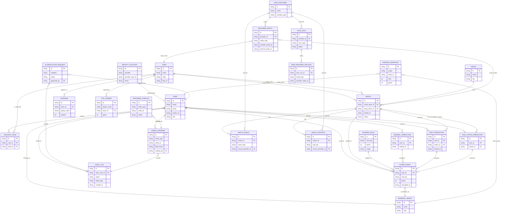

# Modelo Conceptual de Datos

```mermaid
erDiagram
  IDENTITY_ACCOUNT ||--|| USER : authenticates
  USER }o--|| INTERNAL_GROUP : belongs_to
  USER ||--o{ FAVORITE_TEAM : selects
  USER ||--o{ GENERAL_PREDICTION : submits
  USER ||--o{ DAILY_PREDICTION : submits
  USER ||--o{ DAILY_EXTRA_PREDICTION : submits
  USER ||--o{ SCORE_EVENT : receives
  USER ||--o{ ADMIN_OVERRIDE : creates
  USER ||--o{ AUDIT_LOG : performs

  TEAM ||--o{ FAVORITE_TEAM : is_selected
  TEAM ||--o{ MATCH : home_team
  TEAM ||--o{ MATCH : away_team
  TEAM ||--o{ STANDING : appears_in
  TEAM ||--o{ TOP_SCORER : represents

  VENUE ||--o{ MATCH : hosts
  MATCH ||--o{ DAILY_PREDICTION : receives
  MATCH ||--o{ DAILY_EXTRA_PREDICTION : can_be_highest_scoring
  MATCH ||--o{ MATCH_EVENT : has
  MATCH ||--o{ MATCH_STATISTIC : has
  MATCH ||--o{ SCORE_EVENT : produces

  SCORING_RULE ||--o{ SCORE_EVENT : applies_to
  GENERAL_PREDICTION ||--o{ SCORE_EVENT : produces
  DAILY_PREDICTION ||--o{ SCORE_EVENT : produces
  DAILY_EXTRA_PREDICTION ||--o{ SCORE_EVENT : produces

  SCORE_EVENT }o--|| INTERNAL_GROUP : contributes_to
  RANKING_SNAPSHOT }o--|| USER : ranks_user
  RANKING_SNAPSHOT }o--|| INTERNAL_GROUP : ranks_group

  DATA_PROVIDER ||--o{ PROVIDER_ENTITY : maps
  DATA_PROVIDER ||--o{ SYNC_RUN : executes
  SYNC_RUN ||--o{ RAW_PROVIDER_PAYLOAD : stores
  PROVIDER_ENTITY }o--|| TEAM : maps_team
  PROVIDER_ENTITY }o--|| MATCH : maps_match
  DATA_PROVIDER ||--o{ MATCH_EVENT : sources
  DATA_PROVIDER ||--o{ MATCH_STATISTIC : sources
  PROVIDER_CONFLICT }o--|| ADMIN_OVERRIDE : resolved_by

  AI_RESOLUTION_REQUEST }o--|| USER : approved_by
  AI_RESOLUTION_REQUEST }o--|| AUDIT_LOG : records
  ADMIN_OVERRIDE }o--|| AUDIT_LOG : records

  IDENTITY_ACCOUNT {
    string id PK
    string provider
    string provider_user_id
    string email
  }

  USER {
    string id PK
    string name
    string email
    string avatar_url
    string role
  }

  INTERNAL_GROUP {
    string id PK
    string name
    string slug
  }

  TEAM {
    string id PK
    string name
    string code
    string flag_url
  }

  VENUE {
    string id PK
    string name
    string city
  }

  MATCH {
    string id PK
    string home_team_id FK
    string away_team_id FK
    string kickoff_at
    string status
  }

  GENERAL_PREDICTION {
    string id PK
    string user_id FK
    string locked_at
  }

  DAILY_PREDICTION {
    string id PK
    string user_id FK
    string match_id FK
    string locked_at
  }

  DAILY_EXTRA_PREDICTION {
    string id PK
    string user_id FK
    string match_id FK
  }

  FAVORITE_TEAM {
    string id PK
    string user_id FK
    string team_id FK
  }

  SCORING_RULE {
    string id PK
    string rule_key
    int points
    string scope
  }

  SCORE_EVENT {
    string id PK
    string user_id FK
    string rule_key
    int points
    string calculated_at
  }

  RANKING_SNAPSHOT {
    string id PK
    string scope
    string entity_id
    int rank
    int points
  }

  ADMIN_OVERRIDE {
    string id PK
    string entity_type
    string entity_id
    string field_name
    string created_by FK
  }

  AUDIT_LOG {
    string id PK
    string actor_user_id FK
    string action
    string entity_type
    string created_at
  }

  DATA_PROVIDER {
    string id PK
    string name
    string provider_type
  }

  PROVIDER_ENTITY {
    string id PK
    string provider_id FK
    string entity_type
    string provider_entity_id
    string internal_entity_id
  }

  SYNC_RUN {
    string id PK
    string provider_id FK
    string sync_type
    string status
  }

  RAW_PROVIDER_PAYLOAD {
    string id PK
    string sync_run_id FK
    string entity_type
    string provider_entity_id
  }

  PROVIDER_CONFLICT {
    string id PK
    string entity_type
    string entity_id
    string status
  }

  MATCH_EVENT {
    string id PK
    string match_id FK
    string event_type
    string source_provider_id FK
  }

  MATCH_STATISTIC {
    string id PK
    string match_id FK
    string stat_key
    string source_provider_id FK
  }

  STANDING {
    string id PK
    string team_id FK
    string group_name
    int position
  }

  TOP_SCORER {
    string id PK
    string player_name
    string team_id FK
    int goals
  }

  AI_RESOLUTION_REQUEST {
    string id PK
    string category
    string status
    string approved_by FK
  }
```
