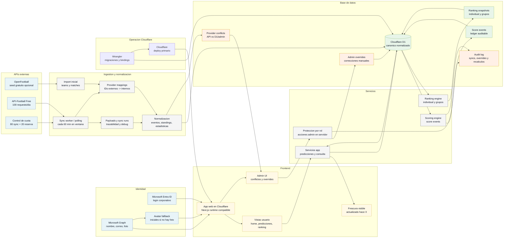

# Arquitectura D1 con Ingestion API-Football Free

Estado: Accepted.

Esta arquitectura asume login corporativo Microsoft como requisito transversal.
API-Football Free es el proveedor deportivo inicial; OpenFootball puede alimentar
seed estatico. D1 es la fuente canonica interna.

## Costos y limites estimados

Fecha de verificacion documental: 2026-06-04. Estos costos son referencia; los
planes pueden cambiar.

| Recurso | Uso | Costo base | Variable de consumo | Riesgo |
| --- | --- | --- | --- | --- |
| Cloudflare Workers / Pages | Hosting, servicios y sync workers. | Workers Paid referencia: USD 5/mes. | Requests dinamicos, cron/polling y CPU. | Medio si sync o recalculos son frecuentes. |
| Cloudflare D1 | Fuente canonica, cache normalizado, sync runs, conflicts y ranking. | Free: 5M reads/dia, 100K writes/dia, 5GB total. | Reads/writes y storage de payloads. | Medio si payloads no tienen retencion. |
| API-Football Free | Fixtures, resultados, eventos, estadisticas y standings disponibles. | USD 0/mes. | 100 requests/dia. | Alto si polling excede cuota o falta cobertura. |
| OpenFootball | Seed inicial gratuito. | USD 0. | Sin live API. | Bajo; requiere mapeo contra IDs internos/API-Football. |
| Microsoft Graph | Login corporativo, perfil, correo y avatar. | Depende del licenciamiento Microsoft 365 existente. | Llamadas Graph para perfil/foto. | Bajo; validar scopes y fallback de foto. |

Fuentes: [Cloudflare D1 pricing](https://developers.cloudflare.com/d1/platform/pricing/),
[Cloudflare Workers pricing](https://developers.cloudflare.com/workers/platform/pricing/),
[API-Football pricing](https://www.api-football.com/pricing) y
[Microsoft Graph metered APIs](https://learn.microsoft.com/en-us/graph/metered-api-list).
