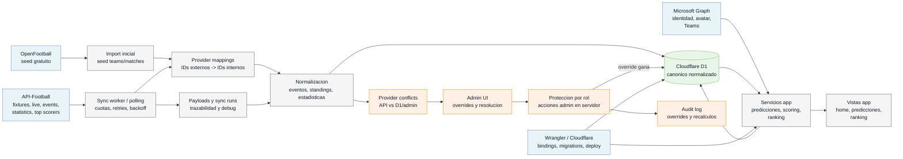

# Arquitectura D1 con Ingestion API-Football

Estado: Proposed / no aprobado.

```mermaid
flowchart LR
  openFootballSeed["OpenFootball<br/>seed gratuito"]
  apiFootballProvider["API-Football<br/>fixtures, live, events,<br/>statistics, top scorers"]
  microsoftGraph["Microsoft Graph<br/>identidad, avatar,<br/>Teams"]
  initialImport["Import inicial<br/>seed teams/matches"]
  syncWorker["Sync worker / polling<br/>cuotas, retries, backoff"]
  providerMappings["Provider mappings<br/>IDs externos -> IDs internos"]
  rawPayloads["Payloads y sync runs<br/>trazabilidad y debug"]
  normalizeData["Normalizacion<br/>eventos, standings, estadisticas"]
  d1Store[("Cloudflare D1<br/>canonico normalizado")]
  providerConflicts["Provider conflicts<br/>API vs D1/admin"]
  adminUi["Admin UI<br/>overrides y resolucion"]
  roleGuard["Proteccion por rol<br/>acciones admin en servidor"]
  appServices["Servicios app<br/>predicciones, scoring,<br/>ranking"]
  appViews["Vistas app<br/>home, predicciones,<br/>ranking"]
  auditLog["Audit log<br/>overrides y recalculos"]
  wranglerOps["Wrangler / Cloudflare<br/>bindings, migrations, deploy"]

  openFootballSeed --> initialImport
  initialImport --> providerMappings
  apiFootballProvider --> syncWorker
  syncWorker --> rawPayloads
  syncWorker --> providerMappings
  providerMappings --> normalizeData
  rawPayloads --> normalizeData
  normalizeData --> d1Store
  normalizeData --> providerConflicts
  providerConflicts --> adminUi
  adminUi --> roleGuard
  roleGuard -->|"override gana"| d1Store
  roleGuard --> auditLog
  microsoftGraph --> appServices
  d1Store --> appServices
  appServices --> d1Store
  appServices --> appViews
  wranglerOps --> d1Store
  wranglerOps --> appServices

  classDef sourceCls fill:#e8f4f8,stroke:#6c8ebf,color:#111827
  classDef storeCls fill:#e8f5e9,stroke:#82b366,color:#111827
  classDef adminCls fill:#fff0e6,stroke:#d79b00,color:#111827
  classDef processCls fill:#f5f5f5,stroke:#666666,color:#111827

  class openFootballSeed,apiFootballProvider,microsoftGraph,wranglerOps sourceCls
  class d1Store storeCls
  class adminUi,roleGuard,providerConflicts,auditLog adminCls
  class initialImport,syncWorker,providerMappings,rawPayloads,normalizeData,appServices,appViews processCls
```
