# Arquitectura D1 con Ingestion API-Football

Estado: Proposed / no aprobado.

Esta propuesta asume login corporativo Microsoft como requisito transversal.
API-Football queda como proveedor deportivo propuesto por costo y amplitud, pero
no como decision aprobada.

```mermaid
flowchart LR
  subgraph identitySection["Identidad"]
    direction TB
    msEntra["Microsoft Entra ID<br/>login corporativo"]
    msGraphProfile["Microsoft Graph<br/>nombre, correo, foto"]
    avatarFallback["Avatar fallback<br/>iniciales si no hay foto"]
  end

  subgraph frontendSection["Frontend"]
    direction TB
    appShell["App web en Cloudflare<br/>Next.js runtime compatible"]
    userViews["Vistas usuario<br/>home, predicciones, ranking"]
    adminUi["Admin UI<br/>conflictos y overrides"]
  end

  subgraph externalApiSection["APIs externas"]
    direction TB
    openFootballSeed["OpenFootball<br/>seed gratuito"]
    apiFootballProvider["API-Football<br/>fixtures, live, events,<br/>statistics, top scorers"]
    quotaAlerts["Alertas de cuota<br/>dashboard y umbrales"]
  end

  subgraph ingestionSection["Ingestion y normalizacion"]
    direction TB
    initialImport["Import inicial<br/>teams y matches"]
    syncWorker["Sync worker / polling<br/>retries y backoff"]
    providerMappings["Provider mappings<br/>IDs externos -> internos"]
    rawPayloads["Payloads y sync runs<br/>trazabilidad y debug"]
    normalizeData["Normalizacion<br/>eventos, standings, estadisticas"]
  end

  subgraph servicesSection["Servicios"]
    direction TB
    appServices["Servicios app<br/>predicciones y consulta"]
    roleGuard["Proteccion por rol<br/>acciones admin en servidor"]
    scoringEngine["Scoring engine<br/>score events"]
    rankingEngine["Ranking engine<br/>snapshots"]
  end

  subgraph databaseSection["Base de datos"]
    direction TB
    d1Store[("Cloudflare D1<br/>canonico normalizado")]
    providerConflicts["Provider conflicts<br/>API vs D1/admin"]
    adminOverrides["Admin overrides<br/>correcciones manuales"]
    scoreEvents["Score events<br/>ledger auditable"]
    rankingSnapshots["Ranking snapshots<br/>individual y grupo"]
    auditLog["Audit log<br/>syncs, overrides y recalculos"]
  end

  subgraph opsSection["Operacion Cloudflare"]
    direction TB
    wranglerOps["Wrangler<br/>migraciones y bindings"]
    cloudflareDeploy["Cloudflare<br/>deploy primario"]
  end

  msEntra --> appShell
  msGraphProfile --> appShell
  msGraphProfile --> avatarFallback
  avatarFallback --> appShell
  appShell --> userViews
  appShell --> adminUi
  userViews --> appServices
  adminUi --> roleGuard
  roleGuard --> adminOverrides
  roleGuard --> auditLog
  openFootballSeed --> initialImport
  apiFootballProvider --> syncWorker
  quotaAlerts --> syncWorker
  initialImport --> providerMappings
  syncWorker --> rawPayloads
  syncWorker --> providerMappings
  providerMappings --> normalizeData
  rawPayloads --> normalizeData
  normalizeData --> d1Store
  normalizeData --> providerConflicts
  providerConflicts --> adminUi
  adminOverrides --> d1Store
  d1Store --> appServices
  appServices --> d1Store
  d1Store --> scoringEngine
  scoringEngine --> scoreEvents
  scoreEvents --> d1Store
  scoringEngine --> auditLog
  d1Store --> rankingEngine
  rankingEngine --> rankingSnapshots
  rankingSnapshots --> d1Store
  wranglerOps --> d1Store
  wranglerOps --> cloudflareDeploy
  cloudflareDeploy --> appShell

  classDef identityCls fill:#e8f4f8,stroke:#6c8ebf,color:#111827
  classDef frontendCls fill:#fff9e6,stroke:#d6b656,color:#111827
  classDef apiCls fill:#e8f4f8,stroke:#6c8ebf,color:#111827
  classDef serviceCls fill:#f5f5f5,stroke:#666666,color:#111827
  classDef storeCls fill:#e8f5e9,stroke:#82b366,color:#111827
  classDef adminCls fill:#fff0e6,stroke:#d79b00,color:#111827

  class msEntra,msGraphProfile,avatarFallback identityCls
  class appShell,userViews,adminUi frontendCls
  class openFootballSeed,apiFootballProvider,quotaAlerts apiCls
  class initialImport,syncWorker,providerMappings,rawPayloads,normalizeData,appServices,roleGuard,scoringEngine,rankingEngine serviceCls
  class d1Store,scoreEvents,rankingSnapshots storeCls
  class providerConflicts,adminOverrides,auditLog adminCls
```

## Costos estimados

Fecha de verificacion: 2026-06-04. Estos costos son referencia documental para
comparar opciones; no aprueban proveedor ni plan final.

| Recurso | Uso en esta propuesta | Costo base | Variable de consumo | Riesgo de costo |
| --- | --- | --- | --- | --- |
| Cloudflare Workers / Pages | Hosting de app, servicios y workers de ingestion. | Workers Paid referencia: USD 5/mes; assets estaticos sin cobro por request segun Workers pricing. | Requests dinamicos, cron/polling y CPU. | Medio por polling durante partidos y procesamiento de payloads. |
| Cloudflare D1 | Fuente canonica, cache normalizado, payloads, sync runs, conflicts y ranking. | Free: 5M rows read/dia, 100K rows written/dia, 5GB total. Paid: primeros 25B reads/mes, 50M writes/mes y 5GB incluidos. | Excedentes Paid: USD 0.001/M reads, USD 1.00/M writes, USD 0.75/GB-mes. | Medio si se guardan payloads crudos sin retencion o hay polling alto. |
| Microsoft Entra ID / Graph | Login corporativo, perfil, correo y avatar. | Depende del licenciamiento Microsoft 365 existente. | Llamadas Graph para perfil/foto y permisos del tenant. | Bajo; validar scopes, consentimiento y fallback de foto. |
| Microsoft Graph / Teams | Recordatorios o anuncios si se integran. | Microsoft indica que desde 2025-08-25 las APIs de Teams ya no son metered. | Otras APIs Graph metered ajenas a Teams pueden requerir Azure subscription. | Bajo para Teams basico; medio si se agregan APIs Graph protegidas. |
| API-Football | Fixtures, live, events, statistics, standings y top scorers. | Free USD 0/mes con 100 requests/dia; Pro USD 19/mes con 7,500 requests/dia; Ultra USD 29/mes con 75,000 requests/dia; Mega USD 39/mes con 150,000 requests/dia. | Requests/dia, frecuencia de polling y cantidad de endpoints por partido. | Medio-alto; si se agota cuota, la API detiene procesamiento y devuelve error. |
| OpenFootball | Seed inicial gratuito de datos estaticos. | USD 0. | Sin live API ni estadisticas en tiempo real. | Bajo; requiere mapeo contra IDs internos/API-Football. |
| LLM asistivo | No obligatorio en esta propuesta; podria usarse para narrativa o categorias ambiguas. | Proveedor no aprobado. OpenAI solo como referencia por 1M tokens. | Tokens de entrada/salida si se habilita. | Bajo si se deja fuera del flujo operativo; medio si se usa para narrativa frecuente. |
| Wrangler | Configuracion, migraciones, bindings y deploy. | Sin costo directo como CLI. | Depende de recursos Cloudflare operados. | Bajo; riesgo operativo si sync y bindings no quedan versionados. |

Fuentes: [Cloudflare D1 pricing](https://developers.cloudflare.com/d1/platform/pricing/),
[Cloudflare Workers pricing](https://developers.cloudflare.com/workers/platform/pricing/),
[API-Football pricing](https://www.api-football.com/pricing),
[Microsoft Graph metered APIs](https://learn.microsoft.com/en-us/graph/metered-api-list) y
[OpenAI API pricing](https://developers.openai.com/api/docs/pricing).
