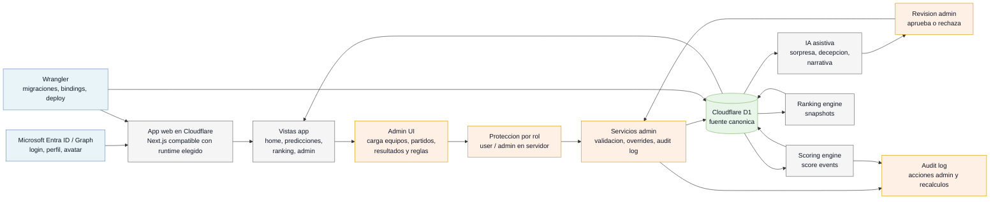

# Arquitectura D1 con Ingesta Manual

Estado: Proposed / no aprobado.

```mermaid
flowchart LR
  microsoftIdentity["Microsoft Entra ID / Graph<br/>login, perfil, avatar"]
  appShell["App web en Cloudflare<br/>Next.js compatible con runtime elegido"]
  adminUi["Admin UI<br/>carga equipos, partidos,<br/>resultados y reglas"]
  roleGuard["Proteccion por rol<br/>user / admin en servidor"]
  adminServices["Servicios admin<br/>validacion, overrides, audit log"]
  assistiveAi["IA asistiva<br/>sorpresa, decepcion,<br/>narrativa"]
  adminReview["Revision admin<br/>aprueba o rechaza"]
  d1Store[("Cloudflare D1<br/>fuente canonica")]
  scoringEngine["Scoring engine<br/>score events"]
  rankingEngine["Ranking engine<br/>snapshots"]
  auditLog["Audit log<br/>acciones admin y recalculos"]
  appViews["Vistas app<br/>home, predicciones,<br/>ranking, admin"]
  wranglerOps["Wrangler<br/>migraciones, bindings, deploy"]

  microsoftIdentity --> appShell
  appShell --> appViews
  appViews --> adminUi
  adminUi --> roleGuard
  roleGuard --> adminServices
  adminServices --> d1Store
  adminServices --> auditLog
  d1Store --> assistiveAi
  assistiveAi --> adminReview
  adminReview --> adminServices
  d1Store --> scoringEngine
  scoringEngine --> d1Store
  scoringEngine --> auditLog
  d1Store --> rankingEngine
  rankingEngine --> d1Store
  d1Store --> appViews
  wranglerOps --> appShell
  wranglerOps --> d1Store

  classDef sourceCls fill:#e8f4f8,stroke:#6c8ebf,color:#111827
  classDef storeCls fill:#e8f5e9,stroke:#82b366,color:#111827
  classDef adminCls fill:#fff0e6,stroke:#d79b00,color:#111827
  classDef processCls fill:#f5f5f5,stroke:#666666,color:#111827

  class microsoftIdentity,wranglerOps sourceCls
  class d1Store storeCls
  class adminUi,roleGuard,adminServices,adminReview,auditLog adminCls
  class appShell,assistiveAi,scoringEngine,rankingEngine,appViews processCls
```
