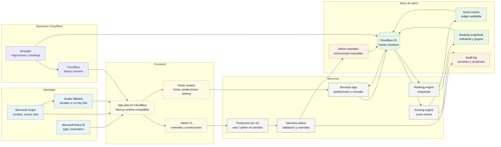

# Arquitectura D1 con Fallback Manual/Admin

Estado: fallback operativo. La arquitectura objetivo aceptada usa ingestion con
API-Football Free. Este flujo conserva el camino manual para overrides,
recuperacion operativa y correcciones admin.

## Uso esperado

- Correcciones manuales cuando API-Football falle o entregue datos discutibles.
- Recuperacion operativa si se agota la cuota free.
- Recalculos o overrides administrativos.
- No incluye LLMs ni resoluciones subjetivas.
