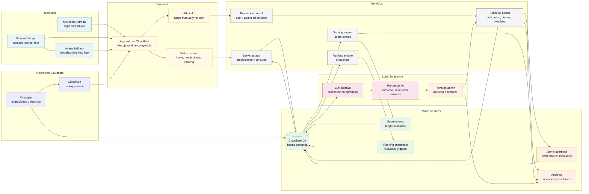

# Arquitectura D1 con Ingesta Manual

Estado: Proposed / no aprobado.

Esta propuesta asume login corporativo Microsoft como requisito transversal. La
ingesta deportiva principal es operada por admin. El LLM forma parte de la
arquitectura como asistencia para categorias subjetivas y narrativa, pero no como
fuente final de verdad.

## Costos estimados

Fecha de verificacion: 2026-06-04. Estos costos son referencia documental para
comparar opciones; no aprueban proveedor ni plan final.

| Recurso | Uso en esta propuesta | Costo base | Variable de consumo | Riesgo de costo |
| --- | --- | --- | --- | --- |
| Cloudflare Workers / Pages | Hosting de la app y servicios server-side. | Workers Paid referencia: USD 5/mes; assets estaticos sin cobro por request segun Workers pricing. | Requests dinamicos y CPU si se excede lo incluido. | Medio si scoring/recalculos o admin generan CPU alta. |
| Cloudflare D1 | Base canonica, predicciones, resultados, overrides, audit log y rankings. | Free: 5M rows read/dia, 100K rows written/dia, 5GB total. Paid: primeros 25B reads/mes, 50M writes/mes y 5GB incluidos. | Excedentes Paid: USD 0.001/M reads, USD 1.00/M writes, USD 0.75/GB-mes. | Bajo al inicio; sube si ranking/scoring hacen full scans sin indices. |
| Microsoft Entra ID / Graph | Login corporativo, nombre, correo y foto. | Depende del licenciamiento Microsoft 365 existente. | Scopes, permisos admin y llamadas Graph para foto/perfil. | Bajo para perfil; validar permisos del tenant y fallback de foto. |
| Microsoft Graph / Teams | Recordatorios o mensajes si se activan despues. | Microsoft indica que desde 2025-08-25 las APIs de Teams ya no son metered. | Otras APIs Graph metered ajenas a Teams pueden requerir Azure subscription. | Bajo para Teams basico; medio si se agregan APIs Graph protegidas o metered. |
| LLM asistivo | Proponer categorias subjetivas y narrativa para revision admin. | Proveedor no aprobado. OpenAI se usa solo como referencia: precios por 1M tokens segun modelo. | Tokens de entrada/salida por solicitud, contexto enviado y reintentos. | Medio; limitar contexto, registrar uso y evitar usarlo para datos objetivos. |
| Wrangler | Configuracion, migraciones, bindings y deploy. | Sin costo directo como CLI. | Depende de recursos Cloudflare operados. | Bajo; riesgo operativo si no se versiona configuracion. |

Fuentes: [Cloudflare D1 pricing](https://developers.cloudflare.com/d1/platform/pricing/),
[Cloudflare Workers pricing](https://developers.cloudflare.com/workers/platform/pricing/),
[Microsoft Graph metered APIs](https://learn.microsoft.com/en-us/graph/metered-api-list) y
[OpenAI API pricing](https://developers.openai.com/api/docs/pricing).
