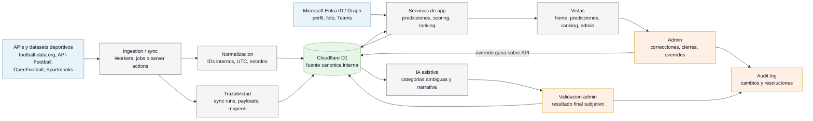

# Propuesta de Ingestion de Datos Externos

Estado: propuesta no aprobada. Este flujo visualiza ADR-0008 y no representa una
decision vigente de implementacion.

```mermaid
flowchart LR
  sportsSources["APIs y datasets deportivos<br/>football-data.org, API-Football,<br/>OpenFootball, Sportmonks"]
  microsoftIdentity["Microsoft Entra ID / Graph<br/>perfil, foto, Teams"]
  syncJobs["Ingestion / sync<br/>Workers, jobs o server actions"]
  normalizeData["Normalizacion<br/>IDs internos, UTC, estados"]
  providerTrace["Trazabilidad<br/>sync runs, payloads, mapeos"]
  d1Store[("Cloudflare D1<br/>fuente canonica interna")]
  appServices["Servicios de app<br/>predicciones, scoring, ranking"]
  appViews["Vistas<br/>home, predicciones, ranking, admin"]
  adminOps["Admin<br/>correcciones, cierres, overrides"]
  auditLog["Audit log<br/>cambios y resoluciones"]
  assistiveAi["IA asistiva<br/>categorias ambiguas y narrativa"]
  adminApproval["Validacion admin<br/>resultado final subjetivo"]

  sportsSources --> syncJobs
  syncJobs --> normalizeData
  syncJobs --> providerTrace
  microsoftIdentity --> appServices
  normalizeData --> d1Store
  providerTrace --> d1Store
  d1Store --> appServices
  appServices --> d1Store
  appServices --> appViews
  appViews --> adminOps
  adminOps -->|"override gana sobre API"| d1Store
  adminOps --> auditLog
  d1Store --> assistiveAi
  assistiveAi --> adminApproval
  adminApproval --> d1Store
  adminApproval --> auditLog

  classDef sourceCls fill:#e8f4f8,stroke:#6c8ebf,color:#111827
  classDef storeCls fill:#e8f5e9,stroke:#82b366,color:#111827
  classDef adminCls fill:#fff0e6,stroke:#d79b00,color:#111827
  classDef processCls fill:#f5f5f5,stroke:#666666,color:#111827

  class sportsSources,microsoftIdentity sourceCls
  class d1Store storeCls
  class adminOps,adminApproval,auditLog adminCls
  class syncJobs,normalizeData,providerTrace,appServices,appViews,assistiveAi processCls
```
