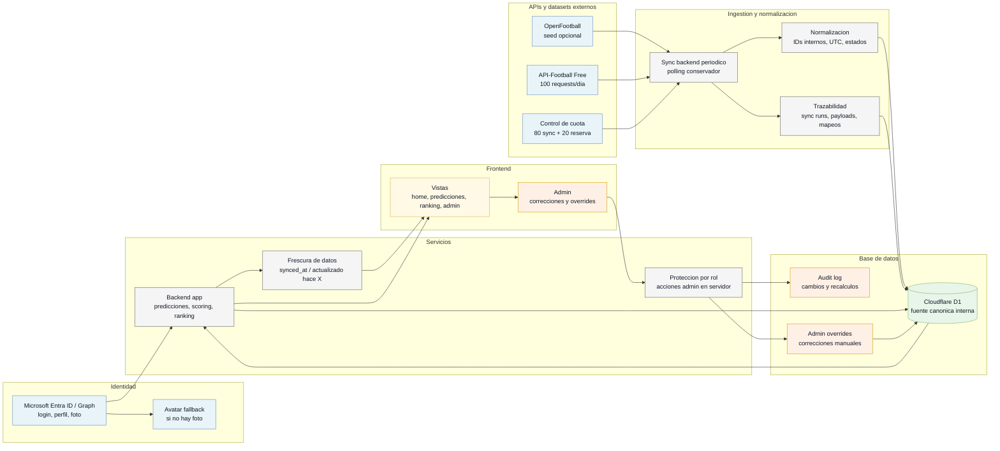

# Ingestion de Datos Externos

Estado: Accepted. Este flujo visualiza ADR-0008 y ADR-0012.

```mermaid
flowchart LR
  subgraph identitySection["Identidad"]
    direction TB
    microsoftIdentity["Microsoft Entra ID / Graph<br/>login, perfil, foto"]
    avatarFallback["Avatar fallback<br/>si no hay foto"]
  end

  subgraph externalSourcesSection["APIs y datasets externos"]
    direction TB
    openFootball["OpenFootball<br/>seed opcional"]
    apiFootball["API-Football Free<br/>100 requests/dia"]
    quotaWatch["Control de cuota<br/>80 sync + 20 reserva"]
  end

  subgraph ingestionSection["Ingestion y normalizacion"]
    direction TB
    syncJobs["Sync backend periodico<br/>polling conservador"]
    normalizeData["Normalizacion<br/>IDs internos, UTC, estados"]
    providerTrace["Trazabilidad<br/>sync runs, payloads, mapeos"]
  end

  subgraph databaseSection["Base de datos"]
    direction TB
    d1Store[("Cloudflare D1<br/>fuente canonica interna")]
    auditLog["Audit log<br/>cambios y recalculos"]
    adminOverrides["Admin overrides<br/>correcciones manuales"]
  end

  subgraph servicesSection["Servicios"]
    direction TB
    appServices["Backend app<br/>predicciones, scoring, ranking"]
    roleGuard["Proteccion por rol<br/>acciones admin en servidor"]
    freshness["Frescura de datos<br/>synced_at / actualizado hace X"]
  end

  subgraph frontendSection["Frontend"]
    direction TB
    appViews["Vistas<br/>home, predicciones, ranking, admin"]
    adminUi["Admin<br/>correcciones y overrides"]
  end

  microsoftIdentity --> avatarFallback
  microsoftIdentity --> appServices
  openFootball --> syncJobs
  apiFootball --> syncJobs
  quotaWatch --> syncJobs
  syncJobs --> normalizeData
  syncJobs --> providerTrace
  normalizeData --> d1Store
  providerTrace --> d1Store
  d1Store --> appServices
  appServices --> d1Store
  appServices --> freshness
  freshness --> appViews
  appServices --> appViews
  appViews --> adminUi
  adminUi --> roleGuard
  roleGuard --> adminOverrides
  adminOverrides --> d1Store
  roleGuard --> auditLog

  classDef identityCls fill:#e8f4f8,stroke:#6c8ebf,color:#111827
  classDef apiCls fill:#e8f4f8,stroke:#6c8ebf,color:#111827
  classDef serviceCls fill:#f5f5f5,stroke:#666666,color:#111827
  classDef storeCls fill:#e8f5e9,stroke:#82b366,color:#111827
  classDef adminCls fill:#fff0e6,stroke:#d79b00,color:#111827
  classDef frontendCls fill:#fff9e6,stroke:#d6b656,color:#111827

  class microsoftIdentity,avatarFallback identityCls
  class openFootball,apiFootball,quotaWatch apiCls
  class syncJobs,normalizeData,providerTrace,appServices,roleGuard,freshness serviceCls
  class d1Store storeCls
  class auditLog,adminOverrides,adminUi adminCls
  class appViews frontendCls
```
