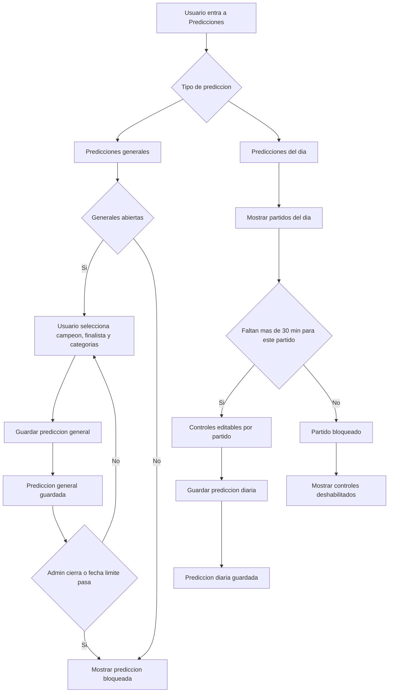

# Ciclo de Vida de Predicciones

```mermaid
flowchart TD
  A["Usuario entra a Predicciones"] --> B{"Tipo de prediccion"}
  B --> C["Predicciones generales"]
  B --> D["Predicciones del dia"]

  C --> E{"Generales abiertas"}
  E -->|Si| F["Usuario selecciona campeon, finalista y categorias"]
  F --> G["Guardar prediccion general"]
  G --> H["Prediccion general guardada"]
  E -->|No| I["Mostrar prediccion bloqueada"]
  H --> J{"Admin cierra o fecha limite pasa"}
  J -->|Si| I
  J -->|No| F

  D --> K["Mostrar partidos del dia"]
  K --> L{"Faltan mas de 30 min para este partido"}
  L -->|Si| M["Controles editables por partido"]
  M --> N["Guardar prediccion diaria"]
  N --> O["Prediccion diaria guardada"]
  L -->|No| P["Partido bloqueado"]
  P --> Q["Mostrar controles deshabilitados"]
```
