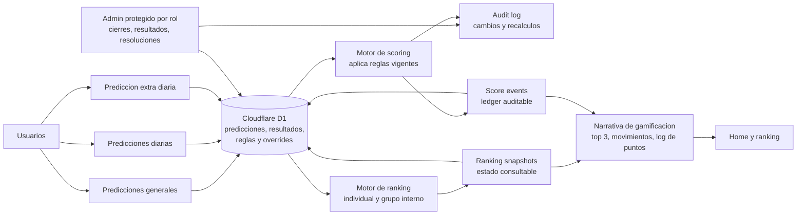

# Flujo de Scoring y Ranking

```mermaid
flowchart LR
  users["Usuarios"] --> generalPredictions["Predicciones generales"]
  users --> dailyPredictions["Predicciones diarias"]
  users --> extraPredictions["Prediccion extra diaria"]

  d1Store[("Cloudflare D1<br/>predicciones, resultados,<br/>reglas y overrides")]
  adminOps["Admin protegido por rol<br/>cierres, resultados, resoluciones"]
  auditLog["Audit log<br/>cambios y recalculos"]
  scoringEngine["Motor de scoring<br/>aplica reglas vigentes"]
  scoreEvents["Score events<br/>ledger auditable"]
  rankingEngine["Motor de ranking<br/>individual y grupo interno"]
  rankingSnapshots["Ranking snapshots<br/>estado consultable"]
  gamification["Narrativa de gamificacion<br/>top 3, movimientos, log de puntos"]
  views["Home y ranking"]

  generalPredictions --> d1Store
  dailyPredictions --> d1Store
  extraPredictions --> d1Store
  adminOps --> d1Store
  adminOps --> auditLog
  d1Store --> scoringEngine
  scoringEngine --> scoreEvents
  scoreEvents --> d1Store
  scoringEngine --> auditLog
  d1Store --> rankingEngine
  rankingEngine --> rankingSnapshots
  rankingSnapshots --> d1Store
  rankingSnapshots --> gamification
  scoreEvents --> gamification
  gamification --> views
```
